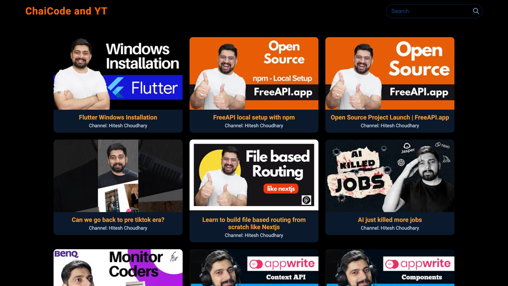
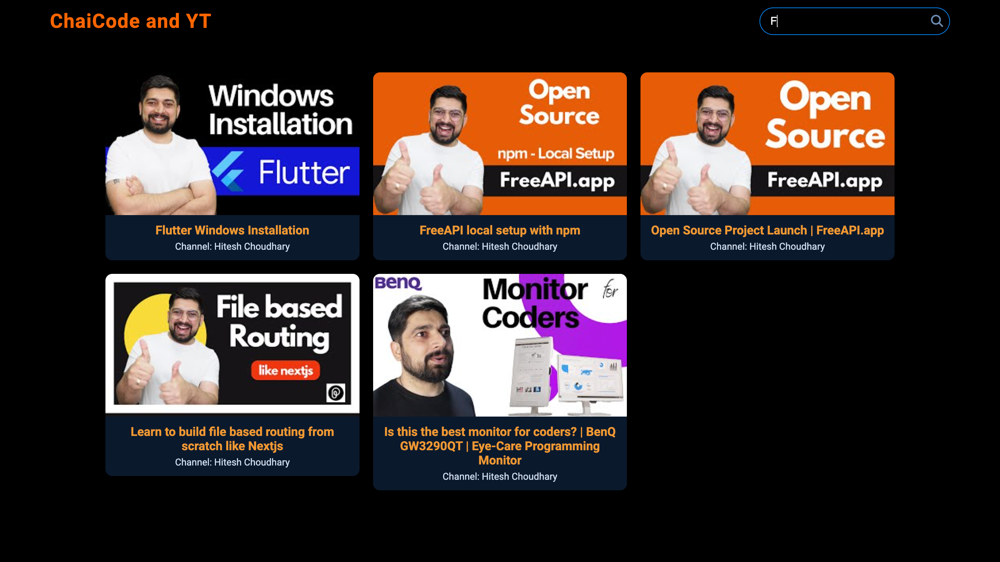

# ChaiCode and YT

A **YouTube-style video listing page** fetches the video from [FreeAPI YouTube endpoint](https://api.freeapi.app/api/v1/public/youtube/videos) and display the video in a grid like format.

## Features

- Fetch and display a list of videos in the form of a grid.
- Display video thumbnails, titles, and channel name for the videos.
- Click on a video to open it in YouTube.
- Add a search bar to filter videos on the frontend.
- Responsive UI

## Technologies Used

- HTML
- CSS 
- JavaScript

## Screenshots

### Deployment Link
[Visit my website](https://random-quote-generator-6j1q.vercel.app/)

